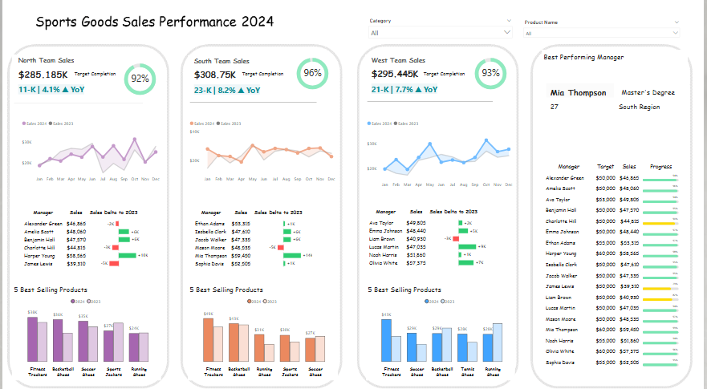

**🏆 Sports Goods Sales Performance 2024 | Power BI**

An interactive Power BI sales analytics dashboard designed to analyze sports goods sales performance across different regions, managers, products, and time periods.

The project focuses on transforming raw sales data into meaningful business insights through data modeling, KPI analysis, target tracking, and interactive visualization.

📊 Dashboard Preview

***🎯 Project Objective***

The main objective of this project is to analyze 2024 sports goods sales performance and provide a clear overview of:

Regional sales performance
Sales vs. target achievement
Year-over-year sales growth
Monthly sales trends
Manager performance
Product sales performance
Best-selling products

The dashboard is designed from a business decision-making perspective, helping management quickly identify strong performance and areas requiring attention.

***🛠️ Tools & Technologies***
Power BI Desktop
Power Query – Data preparation and transformation
DAX – Measures and KPI calculations
Data Modeling
Microsoft Excel / CSV – Source data

***🗂️ Data Model***

The project uses a structured data model consisting of five main tables:

1. 👨‍💼 Managers

Contains information about sales managers and their regional assignments.

2. 🏷️ Products

Contains product information and product categories.

3. 💰 Sales

Contains sales transaction data used for analyzing revenue and product performance.

4. 🎯 Target

Contains sales targets used to measure actual performance against planned goals.

5. 📅 Date

A dedicated date table used for monthly and year-over-year analysis.

***📌 Dashboard Features***

🌍 Regional Performance

The dashboard provides separate performance views for:

North Region
South Region
West Region

Each region includes:

Total sales
Target achievement %
Year-over-year change
Monthly sales trend
Manager performance
Top-selling products

***🎯 Target Achievement***

Sales are compared against predefined targets to monitor regional performance.

The dashboard uses KPI indicators to make it easy to understand whether sales are meeting the expected target.

***📈 Year-over-Year Analysis***

The dashboard compares 2024 sales with 2023 sales to identify changes in sales performance.

This helps answer questions such as:

How much did sales change compared with the previous year?
Which region experienced growth?
Which managers contributed to sales changes?
***👨‍💼 Manager Performance***

The manager table provides a detailed comparison of:

Manager
Target
Sales
Progress toward target

This allows individual manager performance to be reviewed alongside regional results.

***🏆 Top 5 Best-Selling Products***

The dashboard highlights the Top 5 products based on sales performance.

Product performance can also be compared across the available regions.

***🔎 Key Business Questions***

This dashboard was built to answer questions such as:

What are the total sales for each region?
How close is each region to its sales target?
How are 2024 sales performing compared with 2023?
Which months generated the highest sales?
Which managers are closest to their targets?

***🎨 Dashboard Design***

The dashboard was designed with a focus on:

Clean visual hierarchy
Interactive filters
Regional comparison
KPI-focused reporting
Easy-to-read charts
Business-oriented storytelling
Interactive Filters

Users can filter the dashboard by:

Category
Product Name

This allows users to explore sales performance at a more detailed level.

***📚 Learning Outcomes***

Through this project, I practiced:

Building a relational data model
Creating a dedicated Date table
Connecting multiple tables
Creating DAX measures
Designing KPI cards
Comparing actual sales with targets
Performing YoY analysis
Creating Top N product analysis
Building interactive Power BI reports
Presenting data in a business-friendly format

***🙏 Acknowledgement***

A special thank you to Borys Kuznietsov for his Power BI tutorial and project, which provided the inspiration and learning foundation for this project.

This project was created as part of my hands-on Power BI learning journey, with a focus on understanding the underlying data modeling, calculations, and dashboard-building concepts.
Which products are selling the most?
How does product performance differ between regions?
Which areas may require additional management attention?
